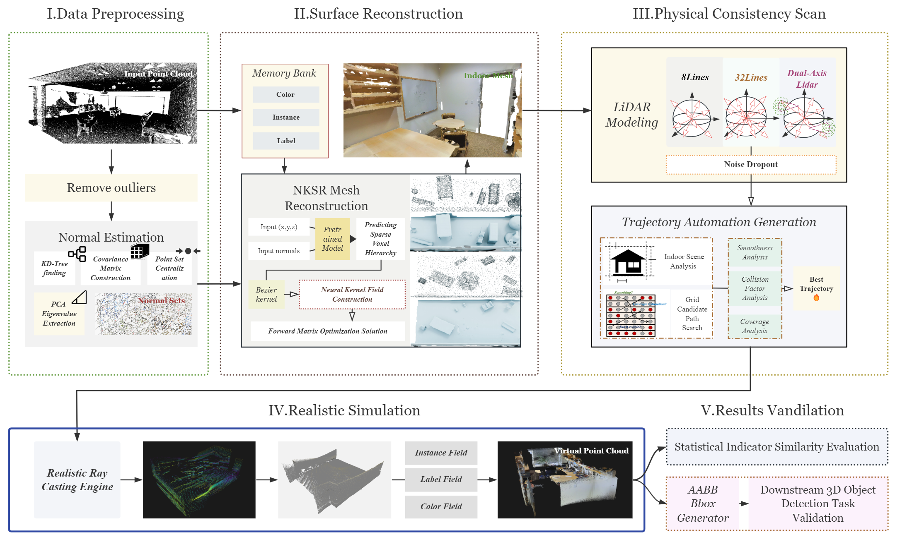
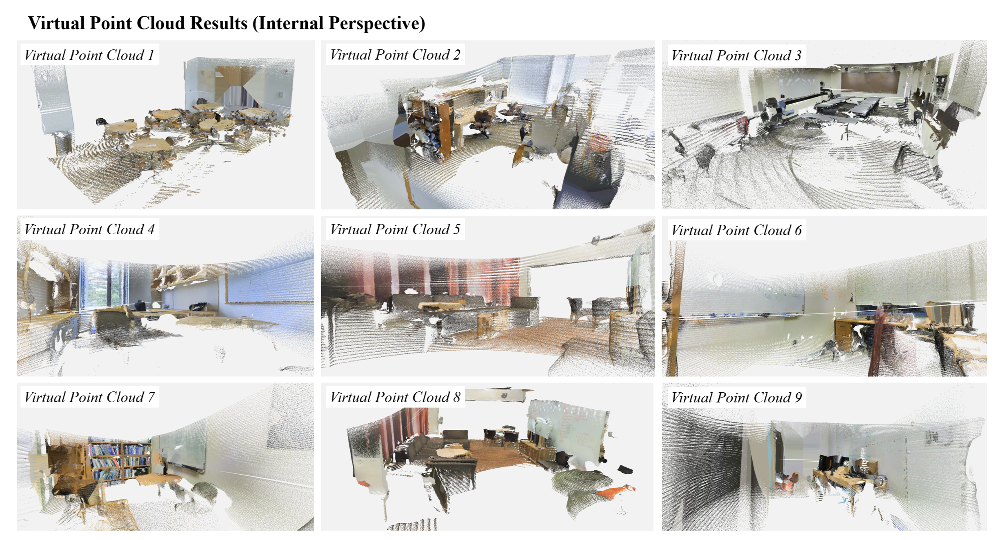
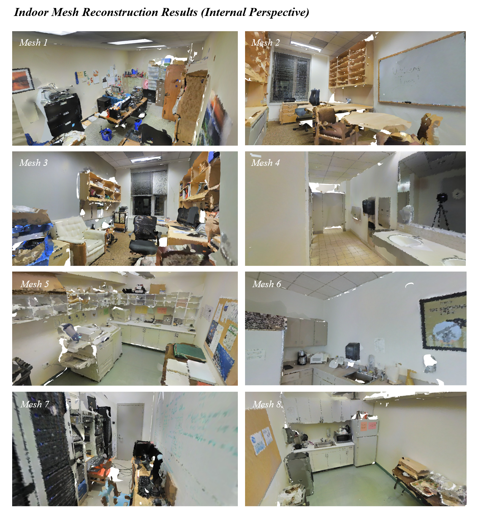

# Indoor Point Cloud Datasets Controllable Generation Method for Mobile Robots 3D Scene Perception - Official Implementation

A controllable indoor point cloud dataset generation pipeline that transforms static TLS (Terrestrial Laser Scanning) datasets into physically-realistic mobile LiDAR point clouds through domain transfer.


## Key Features

- **High-Fidelity Surface Reconstruction**: PCA-based normal estimation with NKSR (Neural Kernel Surface Reconstruction) for topologically complete and geometrically smooth meshes
- **Realistic LiDAR Simulation**: Supports single-axis (8-line, 32-line) and dual-axis (BLK2GO) LiDAR models with physically-consistent scanning and noise simulation
- **Automatic Trajectory Generation**: Intelligent trajectory planning with collision detection to maximize coverage and minimize scanning redundancy
- **Semantic & Instance Annotation**: Automatic semantic and instance label assignment with 3D bounding box generation
- **Comprehensive Visualization**: 2D/3D visualization tools for trajectories, scan results, point clouds, and reconstructed meshes

## System Architecture




The framework consists of four main components:
1. **Data Loading & Preprocessing**: S3DIS data loading, outlier removal, normal estimation
2. **Surface Reconstruction**: NKSR-based mesh reconstruction with semantic color encoding
3. **LiDAR Simulation**: Raycasting-based scanning simulation with multiple LiDAR configurations
4. **Trajectory Planning**: Manual and automatic trajectory generation with collision detection

## Results

### Point Cloud Generation



### Mesh Reconstruction



## Installation

### Requirements

- Python 3.8+
- pytorch
- CUDA-capable GPU 
- Open3D 0.17+
- NumPy, SciPy
- Matplotlib
- scikit-learn

### Setup

```bash
# Clone the repository
git clone https://github.com/yourusername/s3dis-lidar-simulation.git
cd s3dis-lidar-simulation

# Install dependencies
pip install -r requirements.txt
#The required library support is currently being updated. Please stay tuned.
```

## Quick Start

### 1. Prepare S3DIS Dataset

Download and organize the S3DIS dataset:
```
S3DIS/
└── raw/
    └── S3DIS/
        └── data/
            └── Stanford3dDataset_v1.2_Aligned_Version/
                ├── Area_1/
                ├── Area_2/
                └── ...
```

### 2. Configure Parameters

Edit `configs/s3dis_config.yaml` to set:
- Data paths
- NKSR reconstruction parameters
- Preprocessing options
- Visualization settings

### 3. For a quick run

```bash
# Step 1: Data Preprocessing
python s3dis_data_loader.py --config config.yaml

# Step 2: Surface Reconstruction
python python s3dis_nksr_reconstructor.py --config s3dis_config.yaml --data_path XXX

# Step 3: Radar Simulation
python s3dis_simulator.py

# Single scene simulation: modify main_single() function in s3dis_simulator.py
# Edit the hard-coded parameters (scene_path, num_waypoints, etc.) and run:
# python -c "from s3dis_simulator import main_single; main_single()"
```


### 4.1 LiDAR-Net Bounding Box Generatior

`lidar_net_bbox_visualizer.py` generates 3D bounding boxes from LiDAR-Net PLY files that contain semantic and instance labels. It processes PLY files and generates detection annotations compatible with Votenet.

```bash
# Process PLY files in a directory
python lidar_net_bbox_visualizer.py --data_root /path/to/ply/files --output_dir /path/to/output
```


### 4.2 S3DIS Bounding Box Generatior

`s3dis_bbox_visualizer.py` generates 3D bounding boxes from S3DIS annotation files. It processes the `Annotations` directory in each S3DIS room and creates detection annotations.

```bash
# Process a specific room
python s3dis_bbox_visualizer.py --data_root /path/to/s3dis --area_name Area_1 --room_name office_1

# Process an entire area
python s3dis_bbox_visualizer.py --data_root /path/to/s3dis --area_name Area_1

# Process all areas
python s3dis_bbox_visualizer.py --data_root /path/to/s3dis --process_all_areas
```

### 5.Eval (Statistics + downstream tasks)

In this paper, we selected four evaluation metrics for assessing point cloud matching and recommend using `evaluate_single_scene` to complete the task.

For downstream task validation, we recommend selecting the most classic `Votenet` or `Groupfree-3D`. Refer to the official implementation for usage instructions. The data preprocessing interface we employ will be provided upon request.

```bash
# Custom Parameters
python evaluate_single_scene.py \
    --s3dis_ply path/to/s3dis_scene.ply \
    --data_root simulation_results \
    --output_dir my_evaluation_results \
    --max_points 15000 \
    --volume_threshold 0.25 \
    --max_candidates 100
```

## Configuration

The main configuration file `configs/s3dis_config.yaml` includes:

- **Data paths**: Root directory, output directory, area/room selection
- **NKSR parameters**: Detail level, voxel size, chunking options
- **Preprocessing**: Normal estimation (PCA or SHS-Net), outlier removal
- **Visualization**: Save options, quality settings, format preferences
- **Evaluation**: Metrics computation (Chamfer distance, mesh quality)

See `configs/s3dis_config.yaml` for detailed parameter descriptions.

## Usage Examples

### Example 1: Basic Simulation

```python
from s3dis_simulator import S3DISSimulator

config = {
    'data_root': 'path/to/s3dis',
    'area': 'Area_6',
    'room': 'office_2'
}

simulator = S3DISSimulator(config)
sim_scene = simulator.simulate_room()
sim_scene.save_results('outputs/')
```

### Example 2: Custom LiDAR Configuration

```python
from lidar import Indoor8LineLidarIntrinsics, IndoorLidar

# Create custom 8-line LiDAR
lidar_intrinsics = Indoor8LineLidarIntrinsics.create_high_resolution_8line()
lidar = IndoorLidar(intrinsics=lidar_intrinsics, pose=pose_matrix)
```

### Example 3: Automatic Trajectory Generation

```python
from trajectory import AutoTrajectoryGenerator
from containers import S3DISScene

scene = S3DISScene(...)
auto_gen = AutoTrajectoryGenerator(scene)
trajectory = auto_gen.generate_trajectory()
```


## Citation

If you use this code in your research, please cite:
```bibtex
@article{yourpaper2024,
  title={Indoor Point Cloud Datasets Controllable Generation Method for Mobile Robots 3D Scene Perception},
  author={Tianyu Gao, Mengnan Shi},
  journal={},
  year={2026}
}
```


## Acknowledgments

- S3DIS dataset: [Ikehata et al., CVPR 2016]
- NKSR: Neural Kernel Surface Reconstruction
- Open3D: Open-source 3D data processing library

## Contact

For questions and issues, please open an issue on GitHub or contact [258681016@qq.com].

